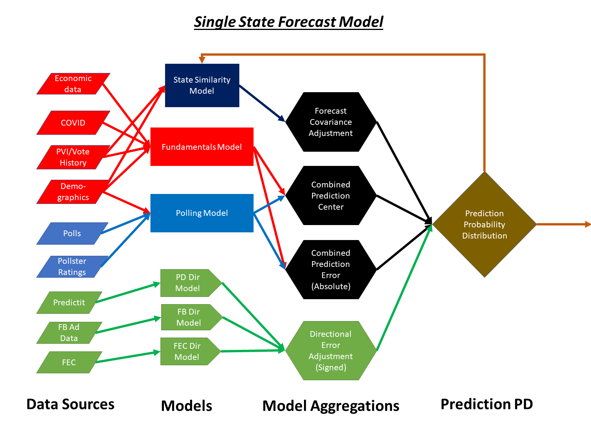

# ElectionMD Forecast

Repo for the 4 module development process for the 2020 forecast.
1. Data Acquisition and Pre-Processing
2. Modelling
3. Forecasting
4. Presentation

## Glossary

**Term** | **Definition**
--- | ---
**Forecast** | Process in which we run multiple simulations, in each of which we repeatedly use the models to make predictions with error and aggregate the results into “election night returns”
**Predictive Model** | A model which maps inputs to a probability distribution describing the voting results
**Directional Model** | A model which maps over-time inputs to a distribution describing the *trend* in vote preferences or issue opinions. These models are used to transform error estimates from the predictive models.
**Reliability Metric** | An indiator of model quality derived from assessing the inputs alone, a.k.a. bullshit meter, for use in weighting the predictive and directional models when combined into the forecast
**Intermix Ratio** | Function used to combine the various models into the forecast, dependent on time to e-day, model quality, and model confidence

## Diagrams

